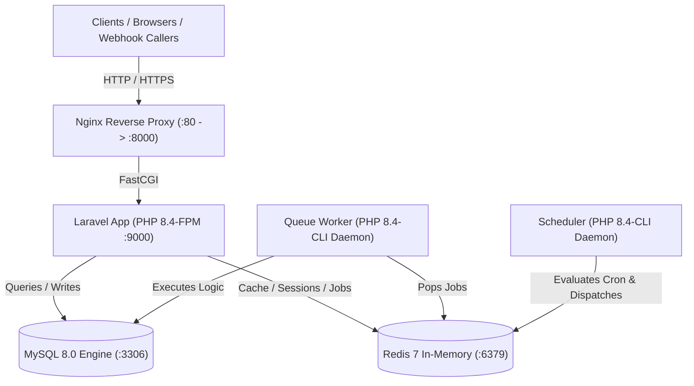

# Deployment & Infrastructure Guide

Panduan operasional dan arsitektur deployment containerized untuk **Invoice & Payment OS** menggunakan Docker, Nginx, PHP 8.4-FPM, MySQL 8.0, dan Redis 7.

---

## Ringkasan Arsitektur Docker

Aplikasi ini dirancang menggunakan arsitektur micro-services terisolasi dalam satu private bridge network (`app-network`):



### Komponen Container:
1. **`invoice_web` (Nginx 1.27)**: Web server reverse proxy, static asset delivery, security headers, gzip compression.
2. **`invoice_app` (PHP 8.4-FPM)**: Laravel backend runner, Opcache diaktifkan, ekstensi PHP lengkap (`pdo_mysql`, `redis`, `bcmath`, `gd`, `zip`, dll).
3. **`invoice_queue` (PHP 8.4-CLI)**: Dedicated background queue worker memproses jobs (seperti `SendInvoiceReminderJob` dan payment notifications).
4. **`invoice_scheduler` (PHP 8.4-CLI)**: Dedicated background task scheduler yang menjalankan `schedule:work` secara otonom tanpa bergantung pada cron host atau terminal terbuka.
5. **`invoice_mysql` (MySQL 8.0)**: Relational database dengan healthcheck otomatis dan persistent volume `mysql_data`.
6. **`invoice_redis` (Redis 7-Alpine)**: High-performance in-memory datastore untuk Cache, Session, dan Queue with AOF persistence.

---

## 1. Development Setup

### Prasyarat
- [Docker Desktop](https://www.docker.com/products/docker-desktop/) (Windows/macOS) atau Docker Engine 24+ & Docker Compose v2+ (Linux).
- Git.

### Langkah-langkah Instalasi Cepat

1. **Clone Repository & Siapkan Environment**:
   ```bash
   git clone <repository-url> invoice-payment-os
   cd invoice-payment-os
   cp .env.example .env
   ```

2. **Sesuaikan Variabel Environment Lokal**:
   Pastikan variabel database dan redis pada `.env` mengarah ke container Docker:
   ```dotenv
   APP_ENV=local
   APP_DEBUG=true
   APP_URL=http://localhost:8000

   DB_CONNECTION=mysql
   DB_HOST=mysql
   DB_PORT=3306
   DB_DATABASE=invoice_payment_os
   DB_USERNAME=invoice_user
   DB_PASSWORD=secret
   DB_ROOT_PASSWORD=root_secret

   QUEUE_CONNECTION=redis
   CACHE_STORE=redis
   SESSION_DRIVER=redis

   REDIS_CLIENT=phpredis
   REDIS_HOST=redis
   REDIS_PORT=6379
   ```

3. **Build & Jalankan Container di Background**:
   ```bash
   docker compose up -d --build
   ```

4. **Generate Application Key**:
   ```bash
   docker compose exec app php artisan key:generate
   ```

5. **Jalankan Database Migration & Seed**:
   ```bash
   docker compose exec app php artisan migrate --seed
   ```

6. **Verifikasi Status Container**:
   ```bash
   docker compose ps
   ```
   Seluruh container (`app`, `nginx`, `queue`, `scheduler`, `mysql`, `redis`) harus berstatus `Up` atau `Up (healthy)`.

7. **Akses Aplikasi**:
   - REST API Base: `http://localhost:8000/api`
   - Swagger / OpenAPI Docs: `http://localhost:8000/api/documentation`

---

## 2. Production Setup

### A. Environment Hardening
Pada server production, pastikan pengaturan keamanan berikut diterapkan di `.env`:
```dotenv
APP_ENV=production
APP_DEBUG=false
APP_URL=https://invoicing.yourdomain.com

# Gunakan credential acak berentropi tinggi
DB_PASSWORD=SuperSecureRandomPassword_99#$
DB_ROOT_PASSWORD=AnotherUltraSecureRootPassword_2026!
PAYMENT_WEBHOOK_SECRET=wsec_live_9f81a7b8e2194cba...
```

### B. Secrets & Configuration Management
- **Jangan commit file `.env` ke Git repository**.
- Gunakan secret manager CI/CD (GitHub Actions Secrets, GitLab CI Variables, atau AWS Secrets Manager) untuk menginjeksi `.env` pada saat provisioning.
- Batasi izin akses file `.env` di host server:
  ```bash
  chmod 600 .env
  chown www-data:www-data .env
  ```

### C. Build Production Image (Immutable Artifacts)
Pada production, asset frontend (Vite) dan dependensi Composer dioptimasi langsung di Docker multi-stage build:
```bash
docker compose build --no-cache
docker compose up -d
```

### D. SSL / TLS Termination
Gunakan reverse proxy terluar (Nginx Host, Traefik, AWS ALB, atau Cloudflare) untuk menangani enkripsi HTTPS / Let's Encrypt:
- Konfigurasikan proxy pass ke port `8000` (atau port host yang ditentukan via `APP_PORT`).
- Pastikan header forwarder disalurkan:
  - `X-Forwarded-For: $proxy_add_x_forwarded_for`
  - `X-Forwarded-Proto: https`
  - `X-Forwarded-Host: $host`

---

## 3. Database Migration

### Menjalankan Migrasi di Production
Gunakan flag `--force` karena pada `APP_ENV=production`, Artisan mencegah modifikasi database yang tidak disengaja:
```bash
docker compose exec app php artisan migrate --force
```

### Zero-Downtime Migration Best Practices
Untuk menjaga availability sistem invoice & payment selama deployment:
1. **Expand and Contract Pattern**:
   - **Langkah 1**: Tambahkan kolom baru yang bersifat nullable atau memiliki default value. Deploy kode baru yang membaca/menulis kolom baru.
   - **Langkah 2**: Jalankan background backfill data jika diperlukan.
   - **Langkah 3**: Hapus kolom lama pada rilis migrasi berikutnya setelah kode lama tidak aktif lagi.
2. **Jangan Mengunci Tabel (Locking)**:
   - Hindari migrasi besar dengan query berat di traffic jam sibuk.
3. **Rollback Cepat**:
   ```bash
   docker compose exec app php artisan migrate:rollback --step=1 --force
   ```
4. **Peringatan Keras**:
   - **JANGAN PERNAH** menjalankan `migrate:fresh` atau `migrate:reset` pada environment production.

---

## 4. Queue Worker

### Arsitektur Queue Autonomous
Container `invoice_queue` menjalankan worker secara terisolasi tanpa memerlukan supervisor eksternal pada host:
- Command: `php artisan queue:work redis --sleep=3 --tries=3 --max-time=3600 --timeout=90`
- Kebijakan Restart: `restart: unless-stopped` memastikan worker otomatis restart jika server host reboot atau jika process kehabisan memori.
- Parameter `--max-time=3600`: Menghentikan worker secara berkala (setiap 1 jam) agar Docker me-restartnya, mencegah memory leak PHP jangka panjang.

### Monitoring & Pemulihan Jobs
Periksa status antrean dan retry failed jobs langsung via CLI:
```bash
# Cek failed jobs
docker compose exec app php artisan queue:failed

# Retry satu job spesifik berdasarkan UUID
docker compose exec app php artisan queue:retry <job-uuid>

# Retry seluruh failed jobs
docker compose exec app php artisan queue:retry all

# Hapus job yang tidak dapat diproses lagi
docker compose exec app php artisan queue:forget <job-uuid>

# Flush seluruh failed jobs yang kadaluarsa
docker compose exec app php artisan queue:flush
```

---

## 5. Scheduler

### Arsitektur Scheduler Otonom
Container `invoice_scheduler` menjalankan daemon scheduler Laravel secara mandiri:
- Command: `php artisan schedule:work`
- Mengeksekusi pengecekan cron setiap menit di background container.
- **Bebas dari Terminal Terbuka**: Berjalan sebagai daemon container latar belakang yang dipantau Docker engine.

### Task Terjadwal di Aplikasi
- **Invoice Reminders**:
  - Mengecek invoice yang mendekati atau telah melewati jatuh tempo (7 hari sebelum, 3 hari sebelum, hari H, dan overdue).
  - Mengirim notifikasi dan mencatat riwayat ke tabel `invoice_reminders` secara idempotent.

### Manual Test Run Task Scheduler
Untuk menguji eksekusi jadwal tanpa menunggu waktu cron:
```bash
docker compose exec app php artisan schedule:run
```

---

## 6. Cache & Optimization

Pada production, performa framework Laravel harus dimaksimalkan dengan mengaktifkan bytecode caching dan route/config compiling.

### Optimasi Sekali Jalan (Post-Deployment Script)
Jalankan perintah berikut setiap kali selesai melakukan deployment versi baru:
```bash
docker compose exec app php artisan config:cache
docker compose exec app php artisan route:cache
docker compose exec app php artisan view:cache
docker compose exec app php artisan event:cache
```

Atau cukup gunakan satu perintah komprehensif:
```bash
docker compose exec app php artisan optimize
```

### Invalidation / Refresh Cache
Jika ada perubahan konfigurasi atau perlu membersihkan cache:
```bash
# Membersihkan seluruh file cache Laravel
docker compose exec app php artisan optimize:clear

# Membersihkan data cache Redis
docker compose exec redis redis-cli flushdb
```

---

## 7. Logging & Monitoring

### Konfigurasi Log Laravel
Sistem menggunakan daily rotating file handler di `storage/logs/laravel-YYYY-MM-DD.log`:
- Retensi log diatur otomatis melalui `LOG_DAILY_DAYS=14` di `.env`.
- Level log production direkomendasikan `LOG_LEVEL=info` atau `LOG_LEVEL=warning` untuk menghemat ruang disk.

### Memantau Log Container Real-Time
Untuk memeriksa log masing-masing komponen tanpa masuk ke server:
```bash
# Memantau log aplikasi PHP-FPM
docker compose logs -f app

# Memantau aktivitas antrean queue
docker compose logs -f queue

# Memantau eksekusi task scheduler
docker compose logs -f scheduler

# Memantau traffic Nginx web server
docker compose logs -f nginx

# Memantau log database MySQL
docker compose logs -f mysql
```

### Redaksi Data Sensitif
Log aplikasi secara otomatis menyaring parameter rahasia:
- Token autentikasi Bearer / Sanctum disanitasi.
- Webhook signature dan secret key gateway tidak dicetak ke stdout/stderr.
- Data kartu/rekening pembayaran hanya disimpan dalam format mask / reference token.

---

## 8. Backup & Disaster Recovery Strategy

Untuk melindungi data invoice, customer, dan riwayat pembayaran dari kehilangan atau kerusakan perangkat keras, terapkan strategi pencadangan 3-2-1.

### A. Backup Otomatis Database MySQL (Daily Snapshot)
Jalankan skrip dump database secara konsisten menggunakan transaksi read-only tanpa locking tabel:

```bash
#!/bin/bash
set -e

BACKUP_DIR="/var/backups/invoice_os"
TIMESTAMP=$(date +"%Y%m%d_%H%M%S")
BACKUP_FILE="${BACKUP_DIR}/invoice_db_${TIMESTAMP}.sql.gz"

mkdir -p ${BACKUP_DIR}

# Dump MySQL container ke file terkompresi
docker compose exec -T mysql mysqldump \
    -u root -p${DB_ROOT_PASSWORD} \
    --single-transaction \
    --quick \
    --routines \
    --triggers \
    invoice_payment_os | gzip > ${BACKUP_FILE}

echo "Database backup completed: ${BACKUP_FILE}"

# Hapus backup lokal yang lebih tua dari 14 hari
find ${BACKUP_DIR} -name "invoice_db_*.sql.gz" -mtime +14 -delete
```

### B. Backup Persistent Docker Volumes
Untuk mencadangkan persistent volume Docker (`mysql_data` dan `redis_data`):
```bash
# Backup MySQL Volume
docker run --rm -v invoice-payment-os_mysql_data:/data -v /var/backups:/backup \
    alpine tar czf /backup/mysql_data_$(date +%Y%m%d).tar.gz -C /data .

# Backup Redis Volume
docker run --rm -v invoice-payment-os_redis_data:/data -v /var/backups:/backup \
    alpine tar czf /backup/redis_data_$(date +%Y%m%d).tar.gz -C /data .
```

### C. Offsite Storage Synchronization
Unggah file cadangan harian ke cloud object storage (AWS S3, Google Cloud Storage, atau MinIO) dengan Server-Side Encryption (SSE-S3/KMS):
```bash
aws s3 cp /var/backups/invoice_os/ s3://company-backups/invoice-payment-os/ --recursive --exclude "*" --include "*.sql.gz"
```

### D. Prosedur Restore Database (Disaster Recovery Runbook)
1. Siapkan database bersih atau target recovery instance.
2. Jalankan perintah dekompresi dan import SQL:
   ```bash
   gunzip < /var/backups/invoice_os/invoice_db_20260928_120000.sql.gz | \
   docker compose exec -T mysql mysql -u root -p${DB_ROOT_PASSWORD} invoice_payment_os
   ```
3. Verifikasi integritas relasi dan saldo invoice:
   ```bash
   docker compose exec app php artisan tinker --execute "echo 'Invoices: ' . \App\Models\Invoice::count();"
   ```
4. Re-cache konfigurasi dan mulai kembali container queue dan web.

---

## 9. Cheatsheet Perintah Operasional

| Perintah | Deskripsi |
| :--- | :--- |
| `docker compose up -d` | Menjalankan seluruh sistem di background |
| `docker compose stop` | Menghentikan container dengan aman tanpa menghapus data |
| `docker compose restart queue` | Me-restart worker antrean setelah deployment kode baru |
| `docker compose exec app bash` | Membuka shell interaktif di dalam container Laravel |
| `docker compose exec app php artisan tinker` | Masuk ke console REPL Laravel Tinker |
| `docker compose down` | Menghentikan dan menghapus container serta network |
| `docker compose down -v` | **Awas**: Menghapus seluruh container, network, DAN persistent volume database |
