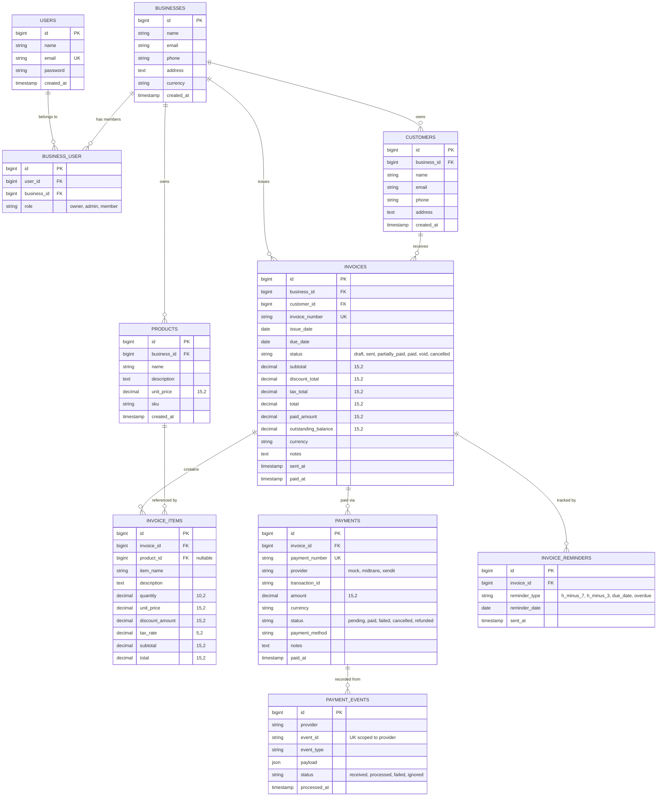
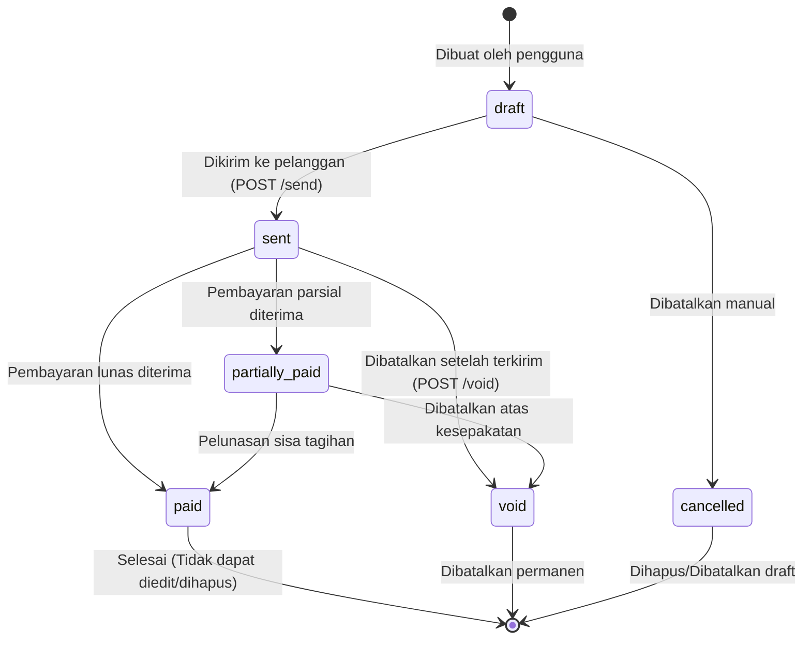
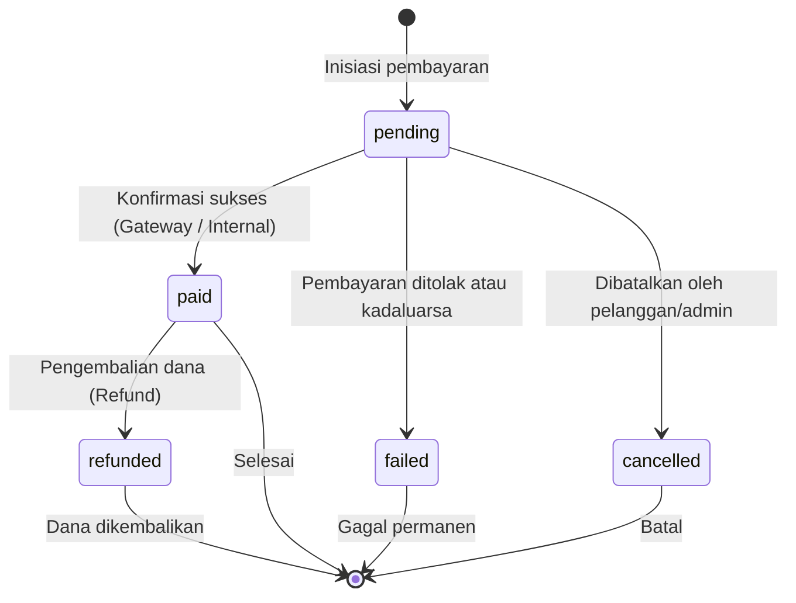
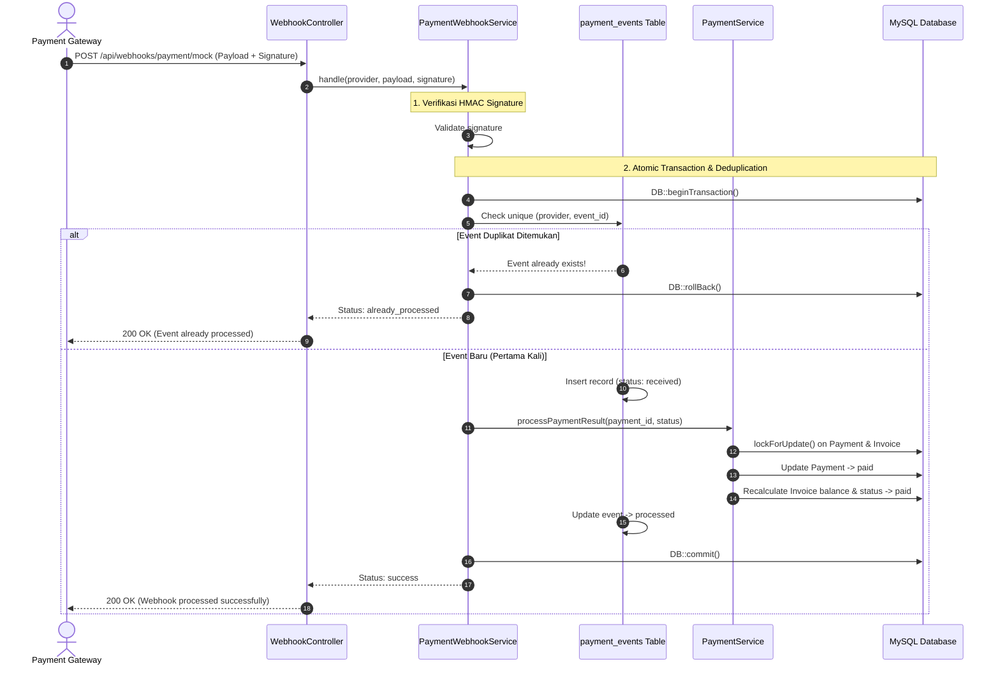

# ⚡ Invoice & Payment OS

> **A production-ready, security-first SaaS backend for multi-tenant invoice lifecycle management, automated reminder queues, resilient idempotent payment processing, and financial reporting.**

[](https://www.php.net/)
[](https://laravel.com/)
[](https://www.mysql.com/)
[](https://redis.io/)
[-brightgreen.svg?style=flat-square)](file:///c:/laragon/www/invoice-payment-os/tests)
[](file:///c:/laragon/www/invoice-payment-os/public/openapi.yaml)
[](file:///c:/laragon/www/invoice-payment-os/LICENSE)

---

##  Table of Contents

- [Project Overview](#-project-overview)
- [System Architecture](#-system-architecture)
- [Entity Relationship Diagram (ERD)](#-entity-relationship-diagram-erd)
- [Technical Highlights](#-technical-highlights)
- [Invoice State Machine](#-invoice-state-machine)
- [Payment State Machine](#-payment-state-machine)
- [Webhook Idempotency & Concurrency](#-webhook-idempotency--concurrency)
- [Example Webhook Flow](#-example-webhook-flow)
- [Queue & Background Scheduling](#-queue--background-scheduling)
- [Security Considerations](#-security-considerations)
- [REST API Documentation & Swagger UI](#-rest-api-documentation--swagger-ui)
- [Example API Requests & Responses](#-example-api-requests--responses)
- [User Interface & PDF Output Previews](#-user-interface--pdf-output-previews)
- [Installation & Quickstart Guide](#-installation--quickstart-guide)
- [Environment Configuration](#-environment-configuration)
- [Automated Testing](#-automated-testing)
- [Docker & Containerized Deployment](#-docker--containerized-deployment)
- [What I Learned](#-what-i-learned)
- [License](#-license)

---

## 🎯 Project Overview

### Masalah yang Diselesaikan (*The Problem*)
Banyak aplikasi penagihan (invoicing) untuk bisnis kecil, UMKM, dan freelancer memiliki celah struktural umum pada backend:
1. **Kebocoran Data Antar-Tenant (IDOR):** Pengguna dapat memodifikasi atau melihat invoice, pelanggan, atau pembayaran milik bisnis lain hanya dengan menebak/mengubah ID pada parameter URL.
2. **Client-Side Pricing Trust:** Frontend mengirimkan nilai total invoice atau kalkulasi diskon yang langsung dipercaya oleh server, membuka celah manipulasi harga (*price tampering*).
3. **Pembayaran Ganda (*Double Balance Update*):** Retry jaringan dari payment gateway sering mengirimkan webhook berulang secara bersamaan (*concurrent delivery*), menyebabkan status invoice terupdate dua kali atau saldo tercatat berlebih.
4. **State Management yang Rapuh:** Invoice yang sudah dibayar (*paid*) atau dibatalkan (*void*) masih dapat diedit atau menerima transaksi baru karena tidak adanya state machine yang ketat.
5. **Ketergantungan Kuat pada Satu Vendor:** Logika pembayaran terikat langsung (*hardcoded*) pada SDK gateway tertentu seperti Midtrans atau Xendit, menyulitkan migrasi vendor di masa depan.

### Solusi (*The Solution*)
**Invoice & Payment OS** dirancang dari nol untuk mengatasi permasalahan tersebut dengan menerapkan arsitektur backend Laravel yang modular, aman, dan berstandar industri:
- **Zero-Trust Financial Calculation:** Server menghitung ulang seluruh subtotal, diskon item, pajak, grand total, dan sisa tagihan (*outstanding balance*) secara otomatis menggunakan tipe data moneter presisi (`DECIMAL(15, 2)`).
- **Workspace-Scoped Data Isolation:** Akses ke setiap model (pelanggan, produk, invoice, pembayaran) diikat ketat pada ID workspace pengguna terautentikasi melalui Policy dan form validation rules.
- **Idempotent Webhook Engine:** Setiap event webhook disimpan dalam tabel `payment_events` dengan indeks unik komposit (`[provider, event_id]`) dan dieksekusi di dalam database transaction untuk mencegah race condition.
- **Payment Gateway Abstraction:** Layer interface terpisah (`PaymentGatewayInterface`) memungkinkan penggantian penyedia gateway (Mock, Midtrans, Xendit, Stripe) tanpa merombak satu baris pun logika bisnis pembayaran.
- **Automated Reminder Queues:** Penjadwalan pengingat jatuh tempo invoice (H-7, H-3, Hari H, Overdue) yang berjalan di background queue terisolasi tanpa memblokir request pengguna.

---

## 🏗️ System Architecture

Arsitektur aplikasi menerapkan pola decoupled services yang dikemas ke dalam kontainer Docker:

```mermaid
flowchart TD
    Client["Web / Mobile / Third-Party Clients"]
    Gateway["External Payment Gateways (Midtrans / Xendit / Mock)"]
    
    subgraph Infrastructure ["Docker Containerized Infrastructure"]
        Nginx["Nginx Reverse Proxy (:8000)"]
        
        subgraph AppCluster ["Laravel PHP 8.4-FPM"]
            APIController["API Controllers & FormRequests"]
            AuthLayer["Sanctum Token & Policy Authorization"]
            ServiceLayer["Domain Services (InvoiceService, PaymentService, WebhookService)"]
            StateMachines["State Engines (InvoiceState, PaymentState)"]
        end
        
        subgraph BackgroundWorkers ["Autonomous CLI Daemons"]
            QueueWorker["Queue Worker Daemon (php artisan queue:work redis)"]
            Scheduler["Task Scheduler Daemon (php artisan schedule:work)"]
        end
        
        subgraph DataStores ["Data & Cache Layer"]
            MySQL[("MySQL 8.0 Engine\n(InnoDB, Foreign Keys, Transactions)")]
            Redis[("Redis 7 In-Memory\n(Cache, Sessions, Queues, AOF)")]
        end
    end

    Client -->|REST API Requests / Bearer Auth| Nginx
    Gateway -->|Webhook Events / HMAC Signature| Nginx
    Nginx -->|FastCGI / Port 9000| APIController
    APIController --> AuthLayer
    AuthLayer --> ServiceLayer
    ServiceLayer --> StateMachines
    ServiceLayer -->|ACID DB Transactions| MySQL
    ServiceLayer -->|Cache & Dispatch Jobs| Redis
    
    Scheduler -->|Evaluates Schedules & Pushes Jobs| Redis
    QueueWorker -->|Pops Jobs (SendInvoiceReminderJob)| Redis
    QueueWorker -->|Executes DB Writes & Notifications| MySQL
```

---

## 🗄️ Entity Relationship Diagram (ERD)

Skema database relasional dirancang menggunakan InnoDB dengan integritas referensial penuh, indeks komposit teroptimasi, dan isolasi multi-tenant berbasis `business_id`:



---

## 🌟 Technical Highlights

### 1. Laravel REST API & Content Negotiation
- Seluruh endpoint API mengikuti standar RESTful dengan HTTP status code semantik (`200 OK`, `201 Created`, `400 Bad Request`, `401 Unauthorized`, `403 Forbidden`, `404 Not Found`, `422 Unprocessable Entity`).
- Input divalidasi ketat menggunakan dedicated **Form Request classes**.
- Output diserialisasi menggunakan **Eloquent API Resources** untuk mencegah kebocoran atribut internal model.

### 2. Sanctum Token Authentication
- Menggunakan token bearer stateless berkinerja tinggi melalui Laravel Sanctum (`/api/login`, `/api/register`, `/api/logout`).
- Mendukung personal access token yang dapat direvoke secara instan.
- Proteksi rate limiting (`throttle:api` & `throttle:auth`) pada endpoint sensitif untuk mencegah serangan brute force.

### 3. Multi-Tenant & Workspace Isolation
- Setiap entitas (Invoice, Customer, Product, Payment) wajib terafiliasi dengan `business_id`.
- Otorisasi diverifikasi secara desentralisasi menggunakan **Laravel Policies** (`InvoicePolicy`, `CustomerPolicy`, `ProductPolicy`, dll).
- Mencegah serangan IDOR: Pengguna A tidak dapat membaca, mengedit, ataupun menghapus resource milik Bisnis B meskipun ID resource diketahui secara valid.

### 4. Strict Invoice State Machine
- Lifecycle invoice dikontrol oleh mesin status ketat (`draft` → `sent` → `partially_paid` → `paid`, dengan status terminal `void` dan `cancelled`).
- Item invoice terkunci otomatis dan tidak dapat diedit setelah invoice berada dalam status non-draft.

### 5. Zero-Trust Payment Processing
- Client dilarang mengirimkan flag `status=paid` secara langsung.
- Nilai outstanding balance selalu dihitung secara deterministik oleh server:
  $$\text{Outstanding Balance} = \text{Total Invoice} - \sum \text{Paid Payments}$$
- Sistem mencegah *overpayment* (pembayaran melebihi sisa tagihan) secara otomatis di tingkat service layer.

### 6. Payment Gateway Abstraction (Strategy Pattern)
- Arsitektur pembayaran mengimplementasikan `PaymentGatewayInterface` (`createPayment()`, `getPaymentStatus()`, `refundPayment()`).
- `PaymentService` hanya bergantung pada abstraksi interface yang diinjeksi melalui Laravel Service Container, memudahkan penggantian antara `MockPaymentGateway`, `MidtransPaymentGateway`, atau `XenditPaymentGateway` melalui konfigurasi `.env`.

### 7. Webhook Idempotency & Concurrency Guard
- Webhook memvalidasi tanda tangan kriptografis HMAC (`X-Webhook-Signature`).
- Deduplikasi event menggunakan composite unique index `[provider, event_id]`.
- Atomic database locking (`lockForUpdate()`) mencegah inkonsistensi saldo akibat webhook ganda yang masuk bersamaan (*concurrent race condition*).

### 8. ACID Database Transactions
- Semua operasi multi-tabel (pembuatan invoice beserta item, pembaruan status pembayaran, agregasi saldo invoice, logging webhook) dibungkus dalam `DB::transaction()` untuk menjamin integritas data (tidak ada data setengah tersimpan saat terjadi kegagalan jaringan atau server).

### 9. Resilient Queue & Task Scheduling
- Menggunakan Redis sebagai antrean queue asinkron untuk tugas berat seperti pengiriman email reminder dan pembuatan invoice PDF.
- Dilengkapi parameter `--tries=3`, backoff eksponensial, dan tabel `failed_jobs` untuk pelacakan error operasional.
- Scheduler otonom (`schedule:work`) mendeteksi invoice mendekati jatuh tempo setiap hari pada pukul 08:00 WIB.

### 10. Multi-Channel Notifications
- Class `InvoiceDueReminderNotification` mengabstraksi pengiriman pesan pengingat ke berbagai channel (Database notification dan Mail log).
- Pencatatan riwayat di tabel `invoice_reminders` menjamin satu invoice tidak pernah menerima jenis pengingat yang sama dua kali pada hari yang sama.

### 11. Automated Testing Suite (132 Tests / 707 Assertions)
- Cakupan pengujian menyeluruh (Unit & Feature Tests) menggunakan PHPUnit.
- Menguji hasil bisnis (*business outcomes*): transisi status invoice, kalkulasi presisi moneter, pencegahan overpayment, deduplikasi webhook identik, dan pembatasan isolasi tenant.

### 12. Complete Docker Containerization
- Lingkungan containerized mandiri dengan 6 decoupled services: Nginx, PHP 8.4-FPM, Autonomous Queue Worker, Autonomous Scheduler Daemon, MySQL 8.0, dan Redis 7.
- Tidak bergantung pada terminal lokal yang harus tetap terbuka.

### 13. Enterprise Security Hardening
- Perlindungan terhadap Mass Assignment melalui `$fillable` eksplisit.
- Sanitasi input terhadap SQL Injection (PDO prepared statements) dan Stored XSS.
- Audit trail dan sanitasi log untuk melindungi data sensitif kredensial pengguna dan signature webhook.

---

## 🔄 Invoice State Machine

Invoice memiliki siklus hidup yang terdefinisi dengan aturan transisi ketat:



### Aturan Transisi:
| Status Awal | Status Tujuan | Syarat & Ketentuan |
| :--- | :--- | :--- |
| `draft` | `sent` | Invoice minimal memiliki 1 item valid. Total > 0. |
| `draft` | `cancelled` | Invoice belum pernah dikirimkan atau diproses. |
| `sent` | `partially_paid` | Pembayaran berhasil tercatat dengan nilai: $0 < \text{Paid} < \text{Total}$. |
| `sent` / `partially_paid` | `paid` | Total pembayaran yang berhasil mencapai nilai total invoice ($\text{Paid} \ge \text{Total}$). |
| `sent` / `partially_paid` | `void` | Pembatalan resmi dengan alasan bisnis. Invoice terkunci dari pembayaran baru. |

---

## 💳 Payment State Machine

Status transaksi pembayaran dikelola secara independen dari invoice:



---

## 🛡️ Webhook Idempotency & Concurrency

Ketika payment gateway pihak ketiga mengirimkan webhook notifikasi pembayaran, sering terjadi **duplicate delivery** akibat retry jaringan atau network latency. Jika tidak ditangani, saldo invoice dapat bertambah dua kali.

### Mekanisme Proteksi Idempotensi:
1. **Verifikasi HMAC Signature:** Header `X-Webhook-Signature` divalidasi menggunakan secret key (`hash_equals()`).
2. **Pemeriksaan Deduplikasi:** Server memeriksa apakah `event_id` dari provider tersebut sudah pernah tercatat di tabel `payment_events`.
3. **Atomic Concurrency Guard:** Operasi dijalankan dalam database transaction dengan pessimistic locking (`lockForUpdate()`).
4. **Idempotent Response:** Jika event duplikat terdeteksi, server mengembalikan status `200 OK` dengan pesan `"Event already processed"` tanpa menjalankan mutasi saldo untuk kedua kalinya.

---

## 🔁 Example Webhook Flow

Diagram interaksi alur pemrosesan webhook dari payment gateway ke sistem:



---

## ⏱️ Queue & Background Scheduling

```
           [ Laravel Scheduler ]  (Runs daily at 08:00 via schedule:work)
                     │
                     ▼
       Find Invoices due in: [H-7, H-3, Today, Overdue]
                     │
                     ▼
         Dispatch SendInvoiceReminderJob
                     │
                     ▼
       ┌───────────────────────────────┐
       │   Redis Queue (default)       │
       └──────────────┬────────────────┘
                      │
                      ▼
        [ Autonomous Queue Worker ]  (php artisan queue:work redis)
                      │
                      ├──> Check Idempotency (invoice_reminders table)
                      ├──> Send InvoiceDueReminderNotification (Mail / DB)
                      └──> Record reminder_date and sent_at
```

- **Scheduler Otonom:** Dijalankan dalam container `invoice_scheduler` dengan command `php artisan schedule:work`.
- **Worker Mandiri:** Dijalankan dalam container `invoice_queue` dengan parameter:
  ```bash
  php artisan queue:work redis --sleep=3 --tries=3 --max-time=3600 --timeout=90
  ```
- **Toleransi Kegagalan:** Job yang gagal otomatis disimpan di tabel `failed_jobs` dan dapat di-retry menggunakan `php artisan queue:retry all`.

---

## 🔒 Security Considerations

Proyek ini telah melalui audit keamanan backend menyeluruh yang didokumentasikan pada **[SECURITY.md](SECURITY.md)**:

1. **IDOR (Insecure Direct Object Reference):** Dieliminasi menggunakan scoping multi-tenant berbasis workspace dan Policy authorization.
2. **Price & Amount Tampering:** Client tidak dapat mengubah total harga; server selalu menghitung ulang seluruh item, diskon, dan pajak.
3. **Mass Assignment:** Model dilindungi dengan atribut `$fillable` eksplisit; atribut sensitif seperti `paid_amount` atau `status` tidak pernah dapat diisi langsung dari form HTTP.
4. **SQL Injection:** Seluruh query database menggunakan Eloquent ORM atau PDO parameterized bindings.
5. **Cross-Site Scripting (XSS):** Seluruh output Blade dan respons JSON di-escape secara otomatis.
6. **API Rate Limiting:** Endpoint autentikasi dibatasi untuk mencegah serangan brute force (misal: 5 percobaan per menit pada login).
7. **Sensitive Parameter Masking:** Token kredensial, signature rahasia, dan nomor transaksi disanitasi dari log file.

---

## 📚 REST API Documentation & Swagger UI

Sistem menyediakan dokumentasi OpenAPI 3.1.0 interaktif yang siap diuji langsung melalui browser:

- **Interactive Swagger UI:** [http://localhost:8000/docs](http://localhost:8000/docs) (atau `/api/documentation`)
- **OpenAPI 3.1 Spec (YAML):** [public/openapi.yaml](public/openapi.yaml)
- **Developer Markdown Reference:** [docs/api-reference.md](docs/api-reference.md)

### Daftar Endpoint Utama:
| Modul | Method | URI | Deskripsi |
| :--- | :--- | :--- | :--- |
| **Auth** | `POST` | `/api/register` | Mendaftarkan akun pemilik baru & workspace |
| **Auth** | `POST` | `/api/login` | Autentikasi & menerbitkan Bearer token |
| **Auth** | `POST` | `/api/logout` | Mencabut Bearer token aktif |
| **Auth** | `GET` | `/api/user` | Mendapatkan profil pengguna terautentikasi |
| **Business** | `GET` | `/api/businesses` | Menampilkan daftar workspace milik user |
| **Customers** | `GET` | `/api/customers` | Menampilkan pelanggan (pagination & search) |
| **Customers** | `POST` | `/api/customers` | Menambahkan pelanggan baru |
| **Products** | `GET` | `/api/products` | Menampilkan katalog produk & layanan |
| **Products** | `POST` | `/api/products` | Menambahkan produk baru dengan harga aman |
| **Invoices** | `GET` | `/api/invoices` | Menampilkan daftar invoice (filter status & tanggal) |
| **Invoices** | `POST` | `/api/invoices` | Membuat draft invoice beserta item |
| **Invoices** | `GET` | `/api/invoices/{id}` | Detail invoice lengkap beserta kalkulasi |
| **Invoices** | `POST` | `/api/invoices/{id}/send` | Transisi status invoice menjadi `sent` |
| **Invoices** | `POST` | `/api/invoices/{id}/void` | Membatalkan invoice secara resmi (`void`) |
| **Invoices** | `GET` | `/api/invoices/{id}/pdf` | Menghasilkan & men-download file PDF invoice |
| **Payments** | `POST` | `/api/invoices/{id}/payments` | Mencatat pembayaran (parsial atau penuh) |
| **Payments** | `GET` | `/api/payments/{id}` | Menampilkan detail transaksi pembayaran |
| **Webhooks** | `POST` | `/api/webhooks/payment/{provider}` | Webhook ingest idempotent dengan signature check |
| **Reports** | `GET` | `/api/reports/revenue` | Laporan agregasi revenue finansial via database query |

---

## 💡 Example API Requests & Responses

### 1. Autentikasi (Login)
```bash
curl -X POST http://localhost:8000/api/login \
  -H "Content-Type: application/json" \
  -H "Accept: application/json" \
  -d '{
    "email": "owner@example.com",
    "password": "password"
  }'
```
**Response (200 OK):**
```json
{
  "token": "1|qWeRtYuIoP1234567890abcdef...",
  "user": {
    "id": 1,
    "name": "Budi Santoso",
    "email": "owner@example.com"
  }
}
```

---

### 2. Membuat Invoice Baru beserta Items
```bash
curl -X POST http://localhost:8000/api/invoices \
  -H "Authorization: Bearer 1|qWeRtYuIoP1234567890abcdef..." \
  -H "Content-Type: application/json" \
  -H "Accept: application/json" \
  -d '{
    "customer_id": 1,
    "issue_date": "2026-09-28",
    "due_date": "2026-10-15",
    "currency": "IDR",
    "notes": "Pembayaran termin 1 pengembangan website",
    "items": [
      {
        "item_name": "Jasa UI/UX Design",
        "description": "Figma mockup & design system",
        "quantity": 1,
        "unit_price": 5000000,
        "discount_amount": 0,
        "tax_rate": 11
      },
      {
        "item_name": "Web Backend Development",
        "description": "API Laravel & Database Setup",
        "quantity": 1,
        "unit_price": 10000000,
        "discount_amount": 1000000,
        "tax_rate": 11
      }
    ]
  }'
```
**Response (201 Created):**
```json
{
  "data": {
    "id": 101,
    "invoice_number": "INV-202609-0001",
    "status": "draft",
    "issue_date": "2026-09-28",
    "due_date": "2026-10-15",
    "subtotal": "15000000.00",
    "discount_total": "1000000.00",
    "tax_total": "1540000.00",
    "total": "15540000.00",
    "paid_amount": "0.00",
    "outstanding_balance": "15540000.00",
    "currency": "IDR"
  }
}
```

---

### 3. Mencatat Pembayaran Parsial
```bash
curl -X POST http://localhost:8000/api/invoices/101/payments \
  -H "Authorization: Bearer 1|qWeRtYuIoP1234567890abcdef..." \
  -H "Content-Type: application/json" \
  -H "Accept: application/json" \
  -d '{
    "amount": 5540000,
    "payment_method": "bank_transfer",
    "notes": "DP Termin 1"
  }'
```
**Response (201 Created):**
```json
{
  "message": "Payment recorded successfully",
  "data": {
    "id": 55,
    "payment_number": "PAY-202609-0055",
    "amount": "5540000.00",
    "status": "paid",
    "invoice": {
      "id": 101,
      "status": "partially_paid",
      "total": "15540000.00",
      "paid_amount": "5540000.00",
      "outstanding_balance": "10000000.00"
    }
  }
}
```

---

### 4. Mengambil Laporan Revenue Finansial
```bash
curl -X GET "http://localhost:8000/api/reports/revenue?date_from=2026-09-01&date_to=2026-09-30" \
  -H "Authorization: Bearer 1|qWeRtYuIoP1234567890abcdef..." \
  -H "Accept: application/json"
```
**Response (200 OK):**
```json
{
  "data": {
    "period": {
      "from": "2026-09-01",
      "to": "2026-09-30"
    },
    "metrics": {
      "total_invoices": 42,
      "total_invoiced": "185000000.00",
      "total_paid": "125000000.00",
      "total_outstanding": "60000000.00",
      "total_overdue": "15000000.00"
    },
    "currency": "IDR"
  }
}
```

---

## 🖥️ User Interface & PDF Output Previews

Sebagai aplikasi backend-first, sistem menyediakan antarmuka dokumentasi bawaan dan rendering layout cetak invoice:

### 1. Interactive Swagger UI (`/docs`)
Swagger UI interaktif terintegrasi langsung di aplikasi tanpa memerlukan compiler eksternal:
```
┌──────────────────────────────────────────────────────────────────────────────┐
│  INVOICE & PAYMENT OS — Interactive API Documentation (OpenAPI 3.1.0)       │
├──────────────────────────────────────────────────────────────────────────────┤
│  [Servers: http://localhost:8000/api]              [ Authorize 🔒 ]          │
│                                                                              │
│  ▼ Authentication                                                            │
│    POST   /register          Register new user & workspace                   │
│    POST   /login             Authenticate and obtain Bearer token            │
│    POST   /logout            Revoke current Bearer token                     │
│                                                                              │
│  ▼ Invoices                                                                  │
│    GET    /invoices          List invoices with pagination & status filters  │
│    POST   /invoices          Create draft invoice with items                 │
│    GET    /invoices/{id}/pdf Download generated invoice PDF document         │
│                                                                              │
│  ▼ Payments & Webhooks                                                       │
│    POST   /invoices/{id}/payments   Record invoice payment (partial/full)    │
│    POST   /webhooks/payment/{prov}  Ingest idempotent gateway webhook        │
└──────────────────────────────────────────────────────────────────────────────┘
```

### 2. Layout Dokumen PDF Invoice (`/api/invoices/{id}/pdf`)
Dihasilkan secara dinamis dari database menggunakan template Blade bersih:
```
┌──────────────────────────────────────────────────────────────────────────────┐
│  ACME DIGITAL CREATIVE                                    INVOICE            │
│  Jakarta Selatan, Indonesia                               #INV-202609-0001   │
│  contact@acmedigital.id                                   Status: PARTIALLY_PAID
├──────────────────────────────────────────────────────────────────────────────┤
│  Ditagihkan Kepada:                    Tanggal Terbit : 28 Sep 2026          │
│  PT Maju Bersama Teknologi            Jatuh Tempo    : 15 Okt 2026          │
│  finance@majubersama.com                                                     │
├──────────────────────────────────────────────────────────────────────────────┤
│  Deskripsi Item              Qty       Harga Satuan      Pajak      Subtotal │
│  Jasa UI/UX Design            1       Rp 5.000.000        11%   Rp 5.000.000 │
│  Web Backend Development      1      Rp 10.000.000        11%   Rp 9.000.000 │
├──────────────────────────────────────────────────────────────────────────────┤
│                                                Subtotal :      Rp 14.000.000 │
│                                                Diskon   :      Rp  1.000.000 │
│                                                PPN (11%):      Rp  1.540.000 │
│                                                TOTAL    :      Rp 15.540.000 │
│                                                Terbayar :      Rp  5.540.000 │
│                                                SISA TAGIHAN:   Rp 10.000.000 │
└──────────────────────────────────────────────────────────────────────────────┘
```

---

## 🚀 Installation & Quickstart Guide

### Opsi 1: Menjalankan dengan Docker Compose (Direkomendasikan)
Cara tercepat untuk menjalankan seluruh ekosistem (PHP, Nginx, MySQL, Redis, Queue, Scheduler):

1. **Clone repository:**
   ```bash
   git clone https://github.com/nasjiarr/invoice-payment-os.git
   cd invoice-payment-os
   ```

2. **Siapkan file environment:**
   ```bash
   cp .env.example .env
   ```

3. **Build dan jalankan seluruh container di background:**
   ```bash
   docker compose up -d --build
   ```

4. **Inisialisasi aplikasi (Key generation, Migrasi & Seed):**
   ```bash
   docker compose exec app php artisan key:generate
   docker compose exec app php artisan migrate --seed
   ```

5. **Aplikasi siap digunakan!**
   - API Root: `http://localhost:8000/api`
   - Swagger Docs: `http://localhost:8000/docs`

---

### Opsi 2: Instalasi Lokal Manual (Non-Docker)

1. **Pastikan prasyarat sistem terpenuhi:**
   - PHP >= 8.3 dengan ekstensi `pdo_mysql`, `bcmath`, `gd`, `zip`, `redis`
   - Composer >= 2.x
   - MySQL >= 8.0
   - Redis Server

2. **Install dependensi & generate key:**
   ```bash
   composer install
   npm install && npm run build
   cp .env.example .env
   php artisan key:generate
   ```

3. **Konfigurasikan database pada `.env`:**
   ```dotenv
   DB_CONNECTION=mysql
   DB_HOST=127.0.0.1
   DB_PORT=3306
   DB_DATABASE=invoice_payment_os
   DB_USERNAME=root
   DB_PASSWORD=
   ```

4. **Jalankan migrasi:**
   ```bash
   php artisan migrate --seed
   ```

5. **Jalankan service:**
   ```bash
   # Terminal 1: Web server
   php artisan serve

   # Terminal 2: Queue worker
   php artisan queue:work redis

   # Terminal 3: Task scheduler
   php artisan schedule:work
   ```

---

## ⚙️ Environment Configuration

Daftar variabel lingkungan penting pada file `.env`:

| Variabel | Default Docker | Keterangan |
| :--- | :--- | :--- |
| `APP_ENV` | `production` / `local` | Mode environment aplikasi |
| `APP_DEBUG` | `false` | Matikan debug stack trace pada production |
| `DB_CONNECTION` | `mysql` | Driver database |
| `DB_HOST` | `mysql` (Docker) / `127.0.0.1` | Host koneksi database MySQL |
| `QUEUE_CONNECTION` | `redis` | Antrean antrean asinkron background jobs |
| `CACHE_STORE` | `redis` | Penyimpanan cache framework & session |
| `REDIS_HOST` | `redis` (Docker) / `127.0.0.1` | Host server Redis |
| `PAYMENT_GATEWAY` | `mock` | Driver gateway (`mock`, `midtrans`, `xendit`) |
| `PAYMENT_WEBHOOK_SECRET` | `your_secret_here` | Kunci rahasia validasi signature webhook |

---

## 🧪 Automated Testing

Proyek ini menerapkan filosofi pengujian yang menguji **hasil bisnis nyata** dan batasan keamanan, bukan sekadar HTTP status code.

```bash
# Menjalankan seluruh test suite (132 tests, 707 assertions)
php artisan test --compact

# Menjalankan test per modul bisnis
php artisan test --filter=InvoiceTest
php artisan test --filter=PaymentServiceTest
php artisan test --filter=PaymentWebhookTest
php artisan test --filter=InvoiceReminderTest
php artisan test --filter=RevenueReportTest
php artisan test --filter=SecurityAuditTest
```

### Ringkasan Cakupan Pengujian:
- **Autentikasi & Autorisasi:** Verifikasi token Sanctum, proteksi endpoint tamu, dan pencabutan token.
- **Tenant Isolation:** Menjamin User Bisnis A mendapat `403 Forbidden` / `404 Not Found` saat mengakses Customer, Invoice, atau Payment milik Bisnis B.
- **Kalkulasi Presisi:** Perhitungan subtotal baris, diskon bertingkat, PPN 11%, dan grand total hingga 2 angka desimal.
- **State Transitions:** Validasi bahwa invoice `paid` tidak dapat di-cancel, dan invoice `draft` tidak dapat langsung dibayar tanpa dikirim.
- **Payment Engine:** Pengujian partial payment, full payment, penolakan overpayment, dan locking saldo.
- **Idempotent Webhooks:** Pengujian pengiriman webhook pertama, webhook duplikat, signature tidak valid, dan concurrent delivery.

---

## 🐳 Docker & Containerized Deployment

Aplikasi dirancang agar dapat di-deploy ke lingkungan VPS atau cloud server mana pun secara portabel.

```bash
# Memeriksa status kesehatan seluruh kontainer
docker compose ps

# Memantau log antrean worker secara real-time
docker compose logs -f queue

# Memantau log scheduler
docker compose logs -f scheduler

# Melakukan restart aman setelah pembaruan kode
docker compose restart app queue
```

Panduan operasional lengkap, strategi backup database harian, log sanitization, dan disaster recovery runbook tersedia di:
👉 **[Panduan Lengkap Operasional & Deployment (DEPLOYMENT.md)](DEPLOYMENT.md)**

---

## 🧠 What I Learned

Mengembangkan **Invoice & Payment OS** memberikan wawasan mendalam mengenai bagaimana merancang sistem backend yang aman, terukur, dan tangguh:

1. **State Machines Membawa Prediktabilitas:**
   Saya belajar bahwa mengelola status invoice dan pembayaran menggunakan boolean flags sederhana (`is_paid`, `is_sent`) sangat rentan menimbulkan data korup. Menerapkan State Pattern yang ketat dengan transisi yang diizinkan (*allowed transitions*) memastikan bahwa entitas bisnis selalu berada dalam status yang valid.

2. **Zero-Trust pada Data Finansial:**
   Jangan pernah memercayai input harga atau total nilai dari client. Menghitung ulang setiap angka di sisi server menggunakan tipe data moneter desimal presisi (`DECIMAL(15, 2)` atau `bcmath`) adalah pertahanan mutlak terhadap manipulasi harga (*price tampering*).

3. **Menghadapi Realitas Sistem Terdistribusi (Idempotency):**
   Di dunia nyata, jaringan internet tidak dapat diandalkan (*unreliable network*). Payment gateway akan melakukan percobaan ulang (*retry*) saat webhook mereka mengalami timeout. Mempelajari cara mengombinasikan *HMAC signature verification*, *unique composite database keys*, dan *pessimistic locking* (`lockForUpdate()`) di dalam database transaction mengajarkan saya cara membangun sistem yang kebal terhadap race condition dan pengiriman event ganda.

4. **Pentingnya Abstraksi Payment Gateway:**
   Mengikat kode bisnis langsung ke SDK vendor tertentu menciptakan *tight coupling* yang berbahaya. Dengan menerapkan *Strategy Pattern* dan *Dependency Injection* melalui Laravel Service Container, sistem dapat beralih antara Mock Gateway, Midtrans, atau Xendit hanya dengan mengubah variabel konfigurasi lingkungan tanpa merusak logika invoice.

5. **Multi-Tenancy & Prinsip Least Privilege:**
   Menjaga keamanan data pelanggan bukan hanya tentang menambahkan middleware autentikasi, melainkan memastikan setiap query database memiliki batasan *scope* tenant (`business_id`). Ini adalah langkah paling fundamental untuk mengeliminasi kerentanan IDOR.

6. **Desain Pengujian Berbasis Hasil Bisnis:**
   Menguji status code `200 OK` saja tidak membuktikan bahwa aplikasi bekerja dengan benar. Tes yang berharga adalah tes yang memvalidasi bahwa setelah pembayaran parsial Rp5.000.000 pada invoice Rp15.000.000, status invoice berubah menjadi `partially_paid` dan sisa saldo tercatat tepat Rp10.000.000 di database.

---

## 📄 License

Proyek ini dirilis di bawah lisensi open-source [MIT License](LICENSE).
Bebas digunakan untuk referensi belajar, portofolio, dan pengembangan aplikasi penagihan mandiri.
